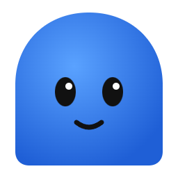
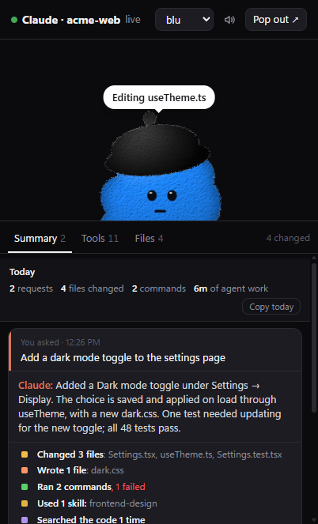
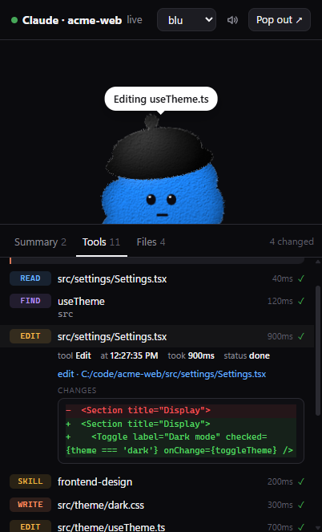
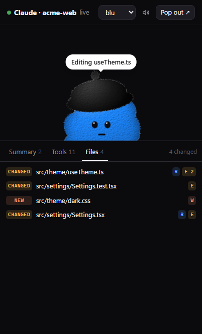

<div align="center">



# dotpals

**See what your coding agent actually did.**

A small floating pal that watches Claude Code, Codex or any agent and tells you, in plain words, what happened: which files changed, which commands ran, what failed, and what the agent says it did.

[](https://github.com/rikinshah787/dotpals/actions/workflows/ci.yml)
[](LICENSE)




</div>

## Why

Coding agents do a lot in a single request. They read dozens of files, edit a handful, run tests, retry and search. The chat scrolls by and the diff is spread across files. dotpals keeps a live, plain-language record next to your editor, so at any moment you can answer:

- **What did it change?** Every file edited, created or deleted, with the diff one click away.
- **What did it run, and did it work?** Every command, with its output, duration and ✓ or ✕.
- **What is it doing right now?** The pal thinks, works, asks for your OK and celebrates, live.
- **What did I get done today?** A running tally, and one click copies it as Markdown for a standup or PR.

## Features

- **Summary**: one card per request, with what you asked, what the agent said it did, and a tally such as *Changed 3 files · Ran 5 commands, 1 failed · Used 1 skill*. **Show steps** lists every step as a short sentence.
- **Tools**: every tool call as it happens. Click one to see the exact command and output, or the lines an edit changed.
- **Files**: every file read, changed, created or deleted, with diffs. Click to open it in VS Code.
- **Today**: requests, files changed, commands run and time the agent spent working. **Copy today** gives you a ready-made standup note.
- **Copy recap**: copy any request as Markdown for a PR description or commit message.
- **One tab per session**: Claude Code and Codex sessions never mix, and the window follows whichever is active.
- **History**: survives restarts. It keeps the last week locally in `~/.dotpals/history.json`.
- **Notifications and sounds**: a ping when the agent needs your OK, a chime when it's done, and a desktop notification if you've looked away.
- **A pal with personality**: eight characters that think, work, talk, wait, celebrate and sulk. Drag the pal anywhere; it stays on top.

<p align="center">
  
  &nbsp;
  
</p>

## Install

### Claude Code

```
/plugin marketplace add rikinshah787/dotpals
/plugin install dotpals@dotpals
```

Restart Claude Code, then run **`/dotpals:pals`**. The first time, it offers to download the desktop window's runtime (Electron, about 100 MB, once). After that, the pal opens by itself whenever a Claude Code session starts.

### Codex

There's nothing to install on the Codex side. dotpals follows Codex's session logs (`~/.codex/sessions`), so the Codex CLI, IDE extension and app all show up. Start the pal once and turn on **Open when I log in** in its tray menu:

```bash
git clone https://github.com/rikinshah787/dotpals && cd dotpals
npm install
npm run float
```

### Any other agent

Send JSON to the local bridge from your agent loop, a hook script or a wrapper. See [Plug in any agent](#plug-in-any-agent).

## Using it

| | |
| --- | --- |
| **Ctrl+Alt+P** (⌘⌥P on macOS) | Show or hide the pal from anywhere |
| Drag the pal | Move the window; it remembers where you put it |
| **⤡** | Switch between just the pal and the full view |
| **×** | Hide to the tray. The tray menu has *Just the pal*, *Notifications*, *Open when I log in* and *Quit* |
| 🔊 | Sounds on or off |

## Privacy

Everything stays on your machine. The bridge listens only on `127.0.0.1`. It reads Claude Code hook events and transcripts and Codex's session logs locally, and it sends nothing anywhere. History is a plain JSON file in `~/.dotpals`. Set `DOTPALS_HISTORY=0` to turn it off, or `DOTPALS_CODEX=0` to stop following Codex. See [SECURITY.md](SECURITY.md).

## How it works

```
Claude Code ── hooks + transcript ─┐
Codex ──────── session logs ───────┼──▶  bridge (127.0.0.1:5175)  ──▶  floating pal  (Summary · Tools · Files)
your agent ─── POST /event ────────┘         one activity model          or any browser tab
```

Each agent connects through an adapter in [`bridge/adapters/`](bridge/adapters), and every adapter produces the same activity entries ([`bridge/activity.js`](bridge/activity.js)). The pal itself is a dependency-free Web Component that you can also drop into your own app (see [below](#use-the-pal-in-your-own-app)).

## Plug in any agent

The bridge is harness-agnostic. Each agent tool connects through an adapter in [bridge/adapters/](bridge/adapters), and every adapter feeds the same activity model ([bridge/activity.js](bridge/activity.js)).

| Harness | How it connects | Setup |
| ------- | --------------- | ----- |
| **Claude Code** | Hooks for live state (including permission prompts), plus the session transcript, so the history is complete even if the pal opened late | [The plugin](#claude-code) |
| **Codex** (CLI, IDE extension, app) | Follows Codex's session logs in `~/.codex/sessions` | None. Keep the pal running (tray: *Open when I log in*). `DOTPALS_CODEX=0` turns it off |
| **Anything else** | POST JSON to `http://127.0.0.1:5175/event` | A few lines in your agent loop, a hook script or a wrapper |

### The event format

Send the pal's state, activity rows, or both. Rows with the same `id` are merged, so you can send a tool call when it starts and again when it finishes:

```bash
# a tool call starts…
curl -s localhost:5175/event -d '{
  "session": "run-42", "harness": "my-agent", "label": "my-project",
  "state": "working", "text": "Running tests",
  "activity": { "id": "call-1", "kind": "run", "tool": "shell", "title": "Run the tests",
                "status": "running", "body": { "command": "npm test" } }
}'

# …and finishes
curl -s localhost:5175/event -d '{
  "session": "run-42", "harness": "my-agent", "state": "thinking",
  "activity": { "id": "call-1", "status": "ok", "ms": 5120, "body": { "output": "42 passing" } }
}'

# a file edit, with its diff
curl -s localhost:5175/event -d '{
  "session": "run-42", "harness": "my-agent",
  "activity": { "id": "call-2", "kind": "edit", "tool": "write_file", "title": "src/app.js", "status": "ok",
                "files": [{ "path": "/abs/path/src/app.js", "change": "edit" }],
                "body": { "patch": "-const a = 1;\n+const a = 2;" } }
}'
```

| Field | Values |
| ----- | ------ |
| `session` | any id; each session gets its own pal and tab |
| `harness`, `label` | shown on the tab, e.g. "My-agent · my-project" |
| `state`, `text` | the pal's state (see [Agent states](#agent-states)) and bubble text |
| `activity.kind` | `prompt` · `read` · `edit` · `write` · `run` · `search` · `web` · `agent` · `mcp` · `skill` · `plan` · `tool` · `done` · `error` |
| `activity.status` | `running` · `waiting` · `ok` · `failed` · `stopped` · `info` |
| `activity.files` | `[{ path, change: "read" | "edit" | "write" | "delete" }]`, which fill the Files tab |
| `activity.body` | `{ command?, patch?, output?, args? }`, which you see when the row is opened |

Any event the pal already understands (Anthropic, OpenAI or Agent SDK stream events, or `{ "state", "text" }`) works here too. To add a first-class adapter, see [bridge/adapters/codex.js](bridge/adapters/codex.js). It's a good template for any harness that writes a session log.

## Use the pal in your own app

The pal is a dependency-free Web Component, `<dot-pal>`, for chat UIs, IDE panels and dashboards. Send it your agent's state and it shows thinking dots while the model reasons, a progress bubble while tools run, a talking mouth while text streams, a question bubble when it needs approval, a jump when it's done and a frown when something fails. It works in plain HTML, React, Vue, Svelte, Angular, Electron and VS Code webviews.

### Characters

| Id      | Pal   | Click action |
| ------- | ----- | ------------ |
| `blu`   | Blu, a blue cloud in a beret        | jump   |
| `hop`   | Hop, a green frog                   | jump   |
| `sunny` | Sunny, a yellow gumdrop in glasses  | wiggle |
| `lovi`  | Lovi, a pink heart in sunglasses    | love   |
| `muse`  | Muse, a violet flame with sparkles  | spin   |
| `grok`  | Grok, a slate bot with a glowing visor | nod |
| `nova`  | Nova, an orange bot with a light-bulb antenna | jump |
| `byte`  | Byte, a teal cat with pixel eyes    | wiggle |

### Quick start

```html
<script type="module" src="https://unpkg.com/dotpals"></script>

<dot-pal id="agent" character="grok"></dot-pal>

<script type="module">
  const pal = document.getElementById('agent');
  pal.setState('thinking');
  pal.setState('working', { text: 'Running tests…' });
  pal.setState('done', { text: 'All green!' });
</script>
```

Or from npm:

```bash
npm install dotpals
```

```js
import 'dotpals';
```

### Agent states

| State       | What the pal does |
| ----------- | ----------------- |
| `idle`      | breathes, blinks and follows the cursor |
| `listening` | leans in with wide eyes, for while the user is typing |
| `thinking`  | looks up, shows a bubble with bouncing dots |
| `working`   | busy bob, eyes down, shows a progress bar or your `text` (e.g. the tool name) |
| `speaking`  | mouth moves, for while tokens stream in |
| `waiting`   | wobbles, shows a `?` bubble or your `text` (e.g. "Allow edit?") |
| `done`      | jumps and smiles, then settles back to calm |
| `error`     | shakes, then looks sad and desaturated |
| `sleeping`  | eyes closed, floating *z*s |

You can set a state three ways:

```html
<dot-pal character="muse" state="thinking"></dot-pal>
```

```js
pal.state = 'speaking';
pal.setState('working', { text: 'web_search' });
```

### Plug into your harness

#### 1. Stream events straight in

`connectAgent` accepts an **EventSource**, a **WebSocket**, any **EventTarget**, or an **async iterable** (such as an SDK stream). It maps each event to a state automatically.

```js
import { connectAgent } from 'dotpals';

// Server-Sent Events from your backend
connectAgent(pal, new EventSource('/agent/events'));

// WebSocket
connectAgent(pal, new WebSocket('wss://my-harness/agent'));

// An SDK stream (async iterable), e.g. the Anthropic TypeScript SDK
const stream = client.messages.stream({ model, max_tokens, messages, tools });
connectAgent(pal, stream);
```

It returns a function that disconnects.

#### 2. Call it from your own event loop

```js
import { agentHandler } from 'dotpals';

const onEvent = agentHandler(pal);

for await (const event of myAgent.run(prompt)) {
  onEvent(event); // unknown events are ignored
  render(event);
}
```

#### Events it understands

| Source | Events | State |
| ------ | ------ | ----- |
| **Anthropic Messages API** (streaming) | `message_start` | thinking |
| | `content_block_start` with a `thinking` block | thinking |
| | `content_block_start` with a `tool_use` block | working, with the tool name |
| | `content_block_start` with a `text` block | speaking |
| | `message_stop` | done |
| **Claude Agent SDK** | `system` / `init` | thinking |
| | `assistant` message with a `tool_use` | working, with the tool name |
| | `assistant` message with text | speaking |
| | `result` | done, or error if it failed |
| **OpenAI Responses API** (streaming) | `response.created` | thinking |
| | `response.output_item.added` with a function call | working |
| | `response.output_text.*` | speaking |
| | `response.completed` | done |
| | `response.failed` | error |
| **Generic** | `{ type: 'tool_call' \| 'permission_request' \| 'error' \| … }` | the matching state |
| **Your own** | `{ state: 'working', text: 'Deploying…' }` | exactly what you send |

Plain strings work too: `'thinking'`, or a JSON string of any of the above.

#### Custom mapping

```js
connectAgent(pal, source, {
  map: (e) => {
    if (e.kind === 'plan') return { state: 'thinking', text: 'Planning…' };
    if (e.kind === 'shell') return { state: 'working', text: `$ ${e.cmd}` };
    return toAgentState(e); // fall back to the built-in mapping
  },
});
```

#### Runnable example

```bash
npm run example:agent   # opens a Server-Sent Events harness on http://localhost:5174
```

See [examples/sse-harness](examples/sse-harness). The server side is about 20 lines. Replace the fake `runAgent` with your real loop.

### More ways to use a pal

```js
// Loading feedback for any promise: thinking, then happy or sad
const data = await pal.during(fetch('/api/save'), { successText: 'Saved!' });

// A form companion: follows the caret, covers its eyes on passwords,
// frowns at invalid fields and cheers on submit
const stop = pal.watch('#login-form');

// Speech bubble
pal.say('Hi! Ask me anything.');

// Show a mood for a moment
pal.flash('surprised', 1500);

// One-shot actions: jump · squish · wiggle · shake · nod · spin · love
await pal.play('love');
```

### Attributes

| Attribute   | Values | Default |
| ----------- | ------ | ------- |
| `character` | any id from the table above, or a registered name | `blu` |
| `state`     | `idle` · `listening` · `thinking` · `working` · `speaking` · `waiting` · `done` · `error` · `sleeping` | `idle` |
| `mood`      | `neutral` · `happy` · `sad` · `surprised` · `thinking` · `sleepy` · `shy` · `listening` · `working` · `speaking` · `waiting` | `neutral` |
| `size`      | number (px) or any CSS length | `160px` |
| `color`     | any CSS color | the character's color |
| `idle`      | `breathe` · `bounce` · `float` · `wobble` · `sway` · `none` | `breathe` |
| `look`      | `cursor` · `none` | `cursor` |
| `static`    | boolean: turns off the hover and click reactions | – |
| `label`     | accessible name | the character's name |

A `state` is the agent lifecycle; each state sets a `mood`. Use `mood` directly if you aren't driving an agent.

### Events

```js
pal.addEventListener('dotpal-state',  (e) => e.detail); // { state, text }
pal.addEventListener('dotpal-mood',   (e) => e.detail); // { mood }
pal.addEventListener('dotpal-action', (e) => e.detail); // { action }
```

### Styling

```css
dot-pal {
  --dp-size: 200px;     /* same as the size attribute */
  --dp-color: hotpink;  /* same as the color attribute */
}

dot-pal::part(bubble) { background: #111; color: #fff; }
dot-pal::part(svg)    { filter: drop-shadow(0 10px 20px rgb(0 0 0 / .4)); }
```

The parts you can style are `root`, `idle`, `actor`, `svg` and `bubble`.

### Frameworks

**React 19+**: `import 'dotpals'`, then `<dot-pal character="grok" state={agentState} />`.

**Vue**: set `compilerOptions.isCustomElement = (tag) => tag === 'dot-pal'`.

**TypeScript**: types are included, and `document.querySelector('dot-pal')` is typed as `DotPal`.

**SSR**: importing on the server is safe. The element renders once it reaches the browser.

### Add your own character

Characters are plain SVG drawn in a `200×200` viewBox. They sit on the bottom edge and "peek" up over it.

```js
import { registerCharacter } from 'dotpals';

registerCharacter('ghost', {
  label: 'Ghost',
  color: '#e8e8ff',
  tap: 'spin',
  look: 6,          // how far the eyes follow the cursor
  mouth: [100, 170], // where mood mouths are drawn
  cheek: 34,         // blush distance from the mouth
  render: ({ body }) => ({
    body: `<rect fill="${body}" x="30" y="50" width="140" height="220" rx="70"/>`,
    face: `
      <g class="dp-look">
        <g class="dp-blink"><circle cx="80" cy="130" r="9"/></g>
        <g class="dp-blink"><circle cx="120" cy="130" r="9"/></g>
      </g>`,
  }),
});
```

- The body is automatically covered in fur and shaded.
- Put `class="dp-blink"` on each eye so it blinks and reacts to moods.
- Put `class="dp-look"` on anything that should follow the cursor.
- Let bodies run below `y=200`, so jumping reveals more body instead of a flat edge.

You can add actions too, with `registerAction('pop', { keyframes, duration, particles })`.

### Accessibility

- Each pal has `role="img"` and an `aria-label` that includes its current mood, for example "Grok (working)".
- With `prefers-reduced-motion: reduce`, idle loops, eye wandering and the floating *z*s are turned off, but state changes are still shown.
- Speech bubbles are decorative. Keep your own visible status text for screen-reader users.

## Roadmap

- **Approve from the pal**: answer "Allow Bash?" with buttons on the pal, without switching windows.
- **More adapters**: Cursor, Gemini CLI, Aider and OpenCode.
- **Weekly recap**: what your agents did this week, per project.
- Signed installers for Windows and macOS.

Ideas and pull requests are welcome. Open an [issue](https://github.com/rikinshah787/dotpals/issues) to discuss.

## Contributing

```bash
npm install        # dev only: Electron for the desktop window
npm test           # node --test, no dependencies needed
npm run float      # the desktop pal
npm run dev        # the web component playground on http://localhost:5173
```

See [CONTRIBUTING.md](CONTRIBUTING.md). To support a new agent, add an adapter next to [`bridge/adapters/codex.js`](bridge/adapters/codex.js), which is a good template for any agent that writes a session log.

## Trademarks

Character names are playful nicknames. dotpals is not affiliated with or endorsed by Anthropic, OpenAI or any other AI company, and the characters are original artwork, not logos.

## License

[MIT](./LICENSE)
